# 🚀 AWS Web Application with Amazon RDS MySQL

A production-style web application deployed on **Amazon EC2** using **Apache HTTP Server** and **PHP**, connected securely to an **Amazon RDS MySQL** database running inside **private subnets** within a custom Amazon VPC.

This project demonstrates core AWS networking, compute, database, Linux administration, and web application deployment concepts while following AWS security best practices.

---

# 📖 Project Overview

The goal of this project was to build a simple employee registration web application hosted on AWS.

Users access the application through a web browser, submit employee information, and the PHP application securely stores the data inside an Amazon RDS MySQL database. The database remains isolated inside private subnets and is accessible only from the EC2 instance using Security Groups.

---

# 🏗️ Architecture


---

# ☁️ AWS Services Used

- Amazon VPC
- Public & Private Subnets
- Internet Gateway
- Route Tables
- Amazon EC2
- Amazon RDS MySQL
- DB Subnet Group
- Security Groups
- Apache HTTP Server
- PHP
- MariaDB (MySQL Client)

---

# 🔨 Project Implementation

## 1. Create a Custom VPC

Created a dedicated VPC instead of using the default VPC to simulate a real-world production environment.

**Screenshot**

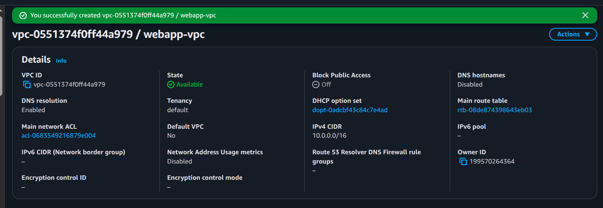

---

## 2. Configure the Network

Created:

- 1 Public Subnet
- 2 Private Subnets
- Internet Gateway
- Public Route Table

The EC2 instance was deployed in the public subnet, while Amazon RDS was deployed inside the private subnets.

**Screenshots**


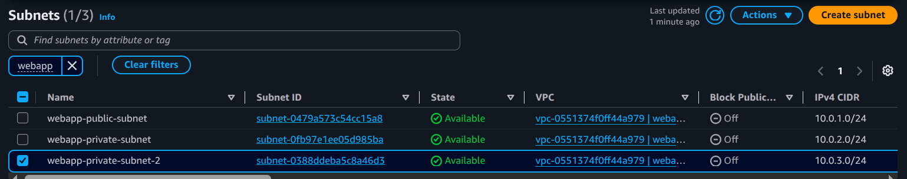

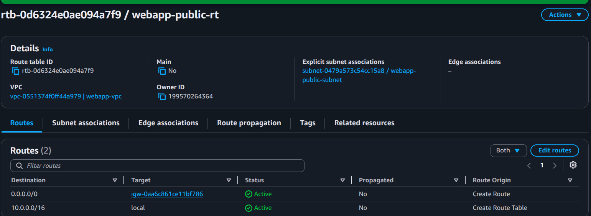

---

## 3. Launch an Amazon EC2 Instance

Created an Amazon Linux EC2 instance inside the public subnet to host the web application.

**Screenshot**

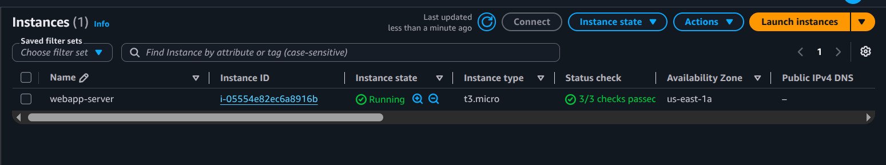

---

## 4. SSH Connection & Linux File Permissions

While connecting to the EC2 instance, SSH refused to use the private key because the key file had **0664** permissions.

Error:

```
Permissions 0664 for 'NextWork key pair1.pem' are too open.
```

The issue was resolved by changing the permissions:

```bash
chmod 600 "NextWork key pair1.pem"
```

### What I Learned

Linux permissions are calculated using numeric values:

| Permission | Value |
|------------|------:|
| Read (r) | 4 |
| Write (w) | 2 |
| Execute (x) | 1 |

Examples:

| Permission | Meaning |
|------------|----------|
| 400 | Read Only |
| 600 | Read + Write |
| 644 | Owner Read/Write, Others Read |
| 755 | Executable Script |

This troubleshooting helped reinforce my understanding of Linux permissions and secure SSH authentication.

**Screenshot**

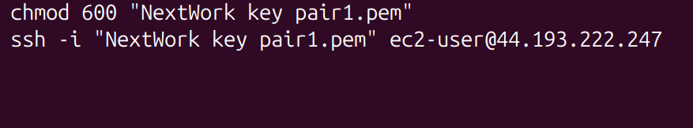

---

## 5. Install Apache & PHP

Installed Apache HTTP Server and PHP on the EC2 instance.

Verified that Apache was running successfully before deploying the application.

**Screenshots**

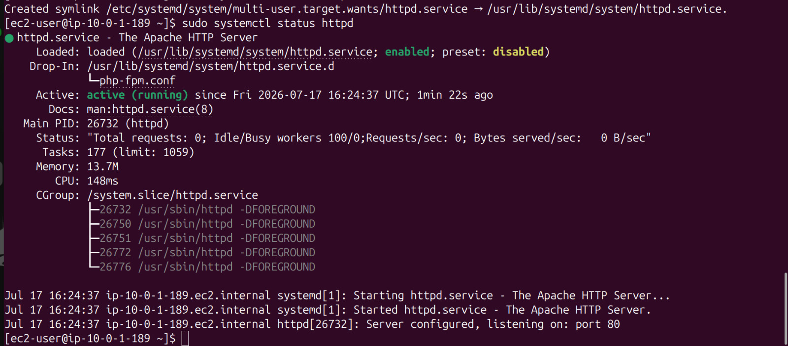

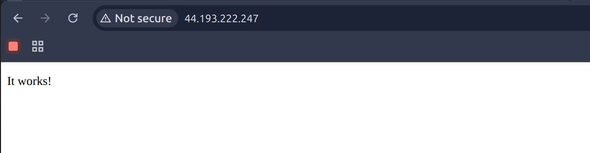

---

## 6. Create Amazon RDS MySQL

Created a DB Subnet Group using the private subnets and launched an Amazon RDS MySQL database instance.

**Screenshots**

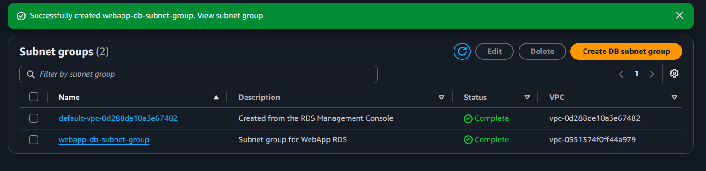

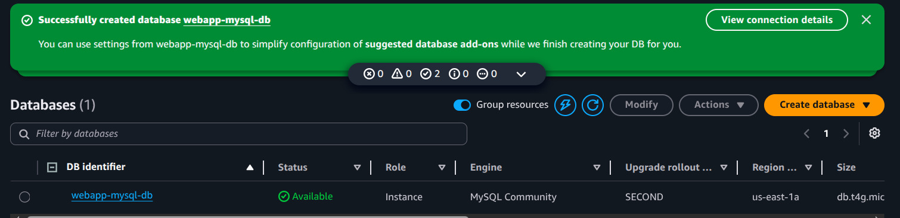

---

## 7. Configure Database Security

Configured the RDS Security Group to allow MySQL traffic (Port 3306) **only** from the EC2 Security Group.

This follows AWS best practices by preventing direct public database access.

**Screenshot**

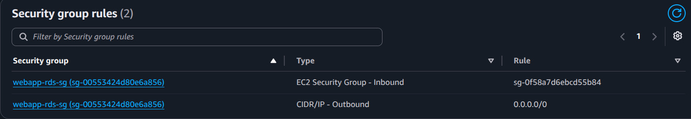

---

## 8. Connect EC2 to Amazon RDS

Connected to Amazon RDS from the EC2 instance using the MySQL client.

Verified the active database and confirmed the employees table structure.

**Screenshots**

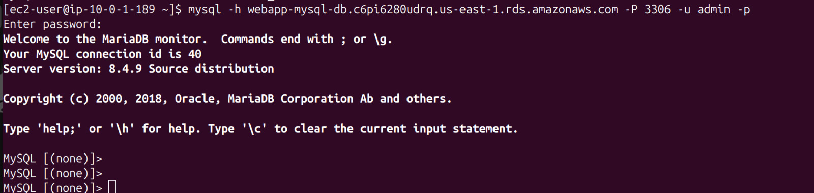

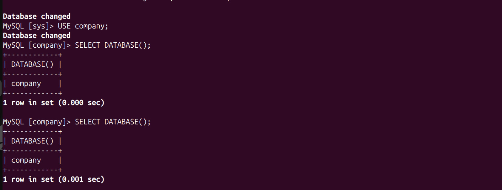

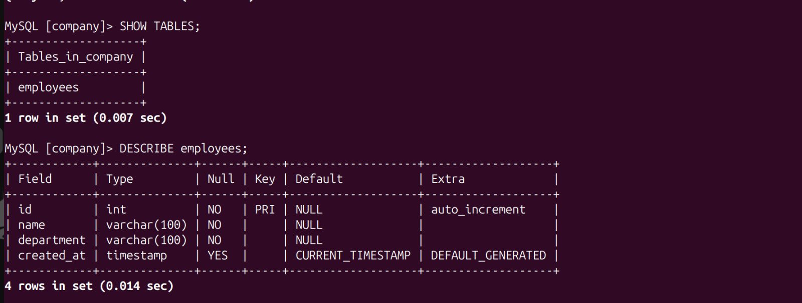

---

## 9. Develop the PHP Web Application

Created three PHP files:

- config.php
- index.php
- save.php

The application allows users to:

- Submit employee details
- Store records in Amazon RDS
- Display stored records dynamically

**Screenshot**

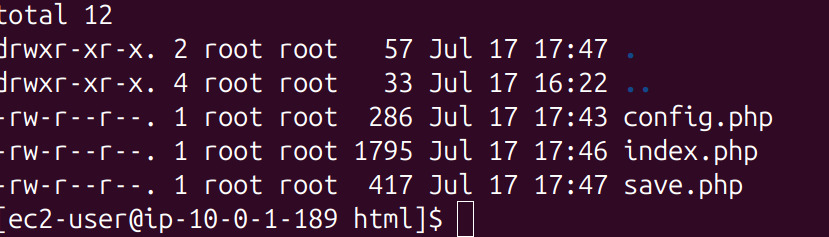

---

## 10. Test the Application

Verified that the application successfully inserts and retrieves employee records from Amazon RDS.

Application homepage:

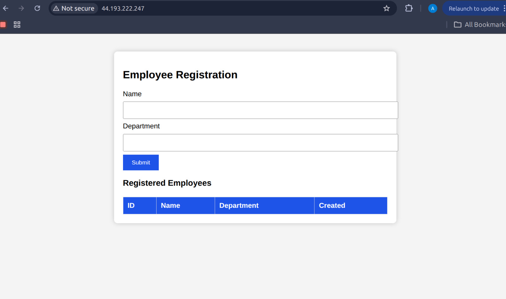

Successful employee registration:

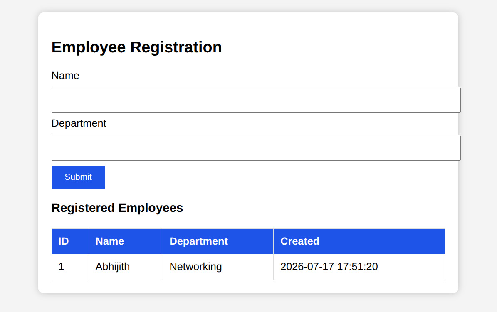

---

# 📂 Project Structure

```text
aws-webapp-rds-mysql-project
│
├── README.md
├── architecture-diagram.png
│
├── 01-webapp-vpc.png
├── 02-public-private-subnets.png
├── 03-additional-private-subnet.png
├── 04-public-route-table.png
├── 05-ec2-instance-running.png
├── 06-ssh-key-permission-fix.png
├── 07-apache-installed-and-running.png
├── 08-apache-test-page.png
├── 09-db-subnet-group-created.png
├── 10-rds-instance-created.png
├── 11-rds-security-group.png
├── 12-rds-connection-from-ec2.png
├── 13-company-database-selected.png
├── 14-employees-table-created.png
├── 15-web-application-files.png
├── 16-web-application-homepage.png
└── 17-employee-record-added.png
```

---

# 🎯 Key Learnings

Throughout this project, I gained hands-on experience with:

- Designing a custom Amazon VPC
- Creating public and private subnets
- Configuring Internet Gateway and Route Tables
- Deploying Amazon EC2
- Installing Apache HTTP Server and PHP
- Creating Amazon RDS MySQL
- Configuring DB Subnet Groups
- Implementing Security Group-to-Security Group communication
- Connecting EC2 to Amazon RDS using MySQL
- Building a PHP web application
- Understanding Linux file permissions (400, 600, 644, 755)
- Troubleshooting SSH authentication issues
- Deploying a complete web application on AWS

---

# 🧹 Resource Cleanup

To avoid unnecessary AWS charges, all project resources were deleted after successful testing.

Resources removed:

- Amazon EC2 Instance
- Amazon RDS MySQL Instance
- DB Subnet Group
- Security Groups
- Route Table
- Internet Gateway
- Public & Private Subnets
- Custom VPC

---

# 👨‍💻 Author

**Abhijith Babu**

Network Support Engineer | AWS Cloud Enthusiast | Building hands-on cloud projects to strengthen practical AWS skills.
